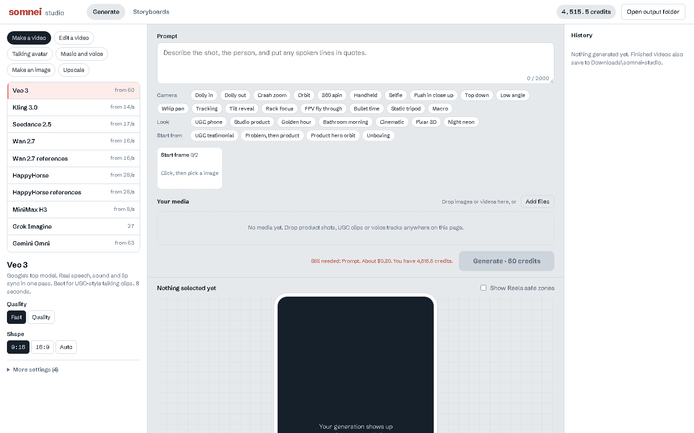
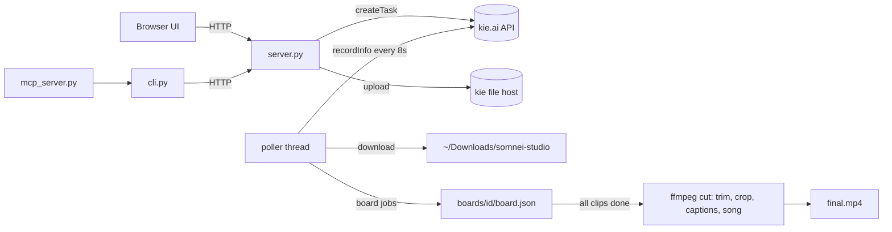

<div align="center">

# somnei studio

**A local, open-source alternative to Higgsfield, running on the kie.ai API.**
25 video, image, avatar and audio models behind one dashboard, a scripted
storyboard pipeline that asks before it spends, and a CLI, MCP server and
Claude Code skills so an AI agent can drive all of it.


[](LICENSE)



</div>

## Why this exists

Hosted studios like Higgsfield bundle three things: access to the best video models, a
workflow layer (camera presets, ad templates, storyboards), and agent tooling (skills, CLI,
MCP). You pay a monthly subscription for all three, and your history lives in their cloud.

Somnei Studio rebuilds that on your own machine. The models come from
[kie.ai](https://kie.ai), which you pay per generation at wholesale prices. The workflow
and agent layers are this repo. Your files, history and storyboards stay on disk.

| | Hosted studio | Somnei Studio |
|---|---|---|
| Billing | Monthly plan, credits expire | Pay per generation, 1 credit = $0.005 |
| Kling 3.0, 5s at 720p | Plan credits | 70 credits, about $0.35 |
| Veo 3 Fast, 8s with speech | Plan credits | 60 credits, about $0.30 |
| Where your work lives | Their cloud | `~/Downloads/somnei-studio`, `boards/` |
| Agent access | Their CLI + skills | Local CLI, MCP server, skills (this repo) |
| Cost shown before every run | Varies | Always. Spending needs an explicit yes. |

## Features

**Generate.** Pick a model and its settings panel is built from `models.json`, so every
knob the API exposes is there: duration, shape, quality tier, native audio, seeds, first
and last frames, reference images, clips and voice tracks. The Generate button shows
the exact credit cost and dollar amount before you click.

- **One-click camera moves and looks:** dolly, crash zoom, orbit, handheld selfie, FPV,
  bullet time, rack focus and more, plus lighting looks and ad shot recipes (UGC
  testimonial, problem then product, unboxing, product hero orbit).
- **Reels safe zones:** preview any result in a phone frame with the caption and button
  areas shaded, so text never ends up under Instagram's UI.
- **Chain generations:** use any result as the input to the next run (make a frame,
  animate it, upscale it, lip sync it).
- **Media library:** drag in product shots, clips and voice tracks once, reuse them
  everywhere. Expired upload links are re-uploaded automatically.

**Storyboards.** An agent writes the concept into timed scenes (line, picture, motion)
and draws a start frame for each one with your reference images, so the character and
the real product stay consistent. You review in the browser:

1. edit any line or prompt inline, redo single frames, flip between takes;
2. pick one of two Suno song takes;
3. leave notes for the agent on any scene;
4. press **Make the video · N credits** to approve.

The server then animates every scene in parallel, trims each clip to its scene,
crops to 1080x1920, burns in captions above the Reels UI, mixes the song, and
writes the final MP4. Redo one clip and recut for free.

**Consistency locks.** Image and video models drift, so every prompt the pipeline
sends is built to prevent it:

- each frame prompt opens with a manifest naming every reference image, then one lock
  line per role (a character keeps the exact face, a product keeps its exact shape and
  markings, a style image contributes only its look);
- each clip prompt ends with a lock that allows one continuous shot and only the
  described action, and forbids on-screen text, which models otherwise add to fill time;
- `fromPrev` scenes start from the previous clip's actual last frame, extracted with
  ffmpeg, so a camera move carries across a cut without a jump.

**Agent layer.** Everything the UI does is available to agents:

- `cli.py`, the `studio` command: JSON output, `studio doctor` health check, prompts from stdin,
  finished job ids as inputs for chaining, and exit code 2 when a command would spend credits without `--yes`
- `mcp_server.py`: 18 tools over stdio for Claude Code, Claude Desktop, Cursor or Codex
- `skills/`: Claude Code skills (`generate`, `storyboard`) that teach model choice, prompting and the approval loop
- `.claude-plugin/`: install the skills and MCP server as one Claude Code plugin

## Models

| Kind | Models | Price on kie.ai |
|---|---|---|
| Video | Veo 3 (Fast / Quality), Kling 3.0, Seedance 2.5, Wan 2.7 (+ references), HappyHorse (+ references), MiniMax H3, Grok Imagine, Gemini Omni | 8 to 158 credits/s, or 27 to 250 per clip |
| Video edit | Wan 2.7 edit, HappyHorse edit, Runway Aleph, Wan 2.2 motion copy, Wan 2.2 person swap | 6 to 48 credits/s, Aleph 110 per clip |
| Talking avatar | OmniHuman 1.5, Kling Avatar (std / pro), InfiniTalk | 3 to 27 credits per second of audio |
| Image | Nano Banana 2, GPT Image 2, Seedream 5 Pro, Flux 2 Pro | 5 to 18 per image |
| Audio | Suno (2 takes), ElevenLabs voiceover | 12 per song, 6 per 1k characters |
| Upscale | Topaz image | 10 to 40 |

Prices come from kie.ai's public price list (checked 2026-09-25) and live in `models.json`.
A unit test fails if any price table misses a combination of settings.

## Quick start

```bash
git clone https://github.com/jwjackw/somnei-studio
cd somnei-studio
export KIE_AI_API_KEY=...        # or put the key in ~/somnei-shopify/.kie-token
python server.py                 # http://localhost:4950
```

Python 3.10+ standard library only, nothing to `pip install`. For storyboard cuts, install
ffmpeg (`winget install Gyan.FFmpeg`, `brew install ffmpeg` or `apt install ffmpeg`).

### Use it from an agent

```bash
# Claude Code plugin: skills + MCP server in one step
/plugin marketplace add jwjackw/somnei-studio
/plugin install somnei-studio@somnei-studio

# or just the MCP server
claude mcp add somnei-studio -- python /path/to/somnei-studio/mcp_server.py
```

```bash
python cli.py models --kind video
python cli.py model kling3
python cli.py generate kling3 -p "slow dolly in, soft morning light" -m image_urls=product.png -s duration=5
#  Kling 3.0 will cost 70 credits ($0.35). Re-run with --yes to spend it.   (exit 2)
python cli.py generate kling3 -p "slow dolly in, soft morning light" -m image_urls=product.png -s duration=5 --yes --wait
python cli.py board create spec.json && python cli.py board frames <id>
python cli.py board render <id> --mode std --yes
```

## How it works



- **One catalog drives everything.** Each model in `models.json` declares its endpoint,
  body shape, settings (with types, enums, limits, which ones take media) and price
  formula. The UI, the cost estimator, the CLI and the MCP tools all read it. Adding a
  model is a JSON edit.
- **Quirks handled in data, not code.** kie.ai models disagree on field names
  (`aspect_ratio` vs `aspectRatio` vs `ratio`), types (Kling wants duration as a string)
  and model ids (text-to-video vs image-to-video). `modelIfEmpty`, `modelIfSet`,
  `modelByParam` and `dropIfSet` rules switch ids and strip fields automatically.
- **Jobs survive the browser.** A background poller tracks every task, downloads
  results and files storyboard clips into their board, then triggers the cut when the
  last clip lands.
- **The key never reaches the browser.** POST routes require a custom header, which a
  cross-site page cannot send.

## Project layout

| Path | What it is |
|---|---|
| `server.py` | HTTP server, kie.ai client, job poller, cost estimator, storyboard pipeline, ffmpeg cut |
| `models.json` | Every model's endpoint, settings and pricing |
| `presets.json` | Camera moves, looks and ad recipes |
| `cli.py` | The `studio` command |
| `mcp_server.py` | MCP server (stdio, JSON-RPC, no SDK needed) |
| `skills/` | Claude Code skills and their references |
| `static/` | Front end, plain HTML/CSS/JS, no build step |
| `tests/` | Offline unit tests (no network, no credits) |

## Tests

```bash
python -m unittest discover tests -v
```

The tests cover request building for every body style, model-id switching, type coercion,
cost formulas, price-table coverage, consistency locks, caption timing and the MCP handshake.

## Roadmap

Informed by a study of the public [higgsfield-ai/skills](https://github.com/higgsfield-ai/skills)
repo (MIT). Its CLI and skill design are open; its ad logic (Marketing Studio modes, prompt
enhancers, Soul training, Virality Predictor) runs on Higgsfield's servers, so each of those
needs a local substitute here.

- [x] Skills, plugin manifest, CLI with cost gate, MCP server
- [x] Camera move, look and ad recipe presets
- [x] Reference manifests, identity and product locks, clip locks, exact-frame handoff
- [ ] **Ad multiplier:** clone a board, swap only the hook scene, reuse every other clip
- [ ] **Product photoshoot modes:** studio, lifestyle, hero banner, Pinterest pin, ad pack and
  more, built from local prompt templates, with variants that change one thing at a time
- [ ] **Static ad formats with a brand lock:** headline, bullets, us-vs-them layouts, exact
  text added in a second pass
- [ ] **Product import:** pull title, copy and images from a Shopify product URL
- [ ] **Character sheets:** a consistent reference set for storyboards, in place of trained identities
- [ ] **Song-timed scenes:** Suno timestamped lyrics set scene boundaries automatically
- [ ] **Hook check:** score the first seconds of a cut (cuts, motion, loudness, face and text
  timing) as a rough stand-in for a virality model, calibrated against real hook rates

## License

MIT. Not affiliated with Higgsfield or kie.ai.
